<!-- markdownlint-disable MD033 MD041 MD060 -->
<div align="center">

# Daftary · دفتري

**A people-first personal finance app for Arabic-speaking users.**
Track who owes you and who you owe, then manage your own income, budgets and savings, all in one notebook that stays on your phone.


-003B57?logo=sqlite&logoColor=white)

%20%7C%20English-orange)


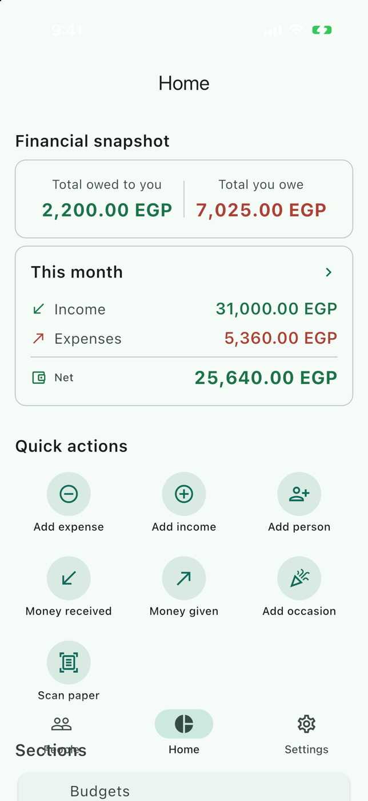
&nbsp;
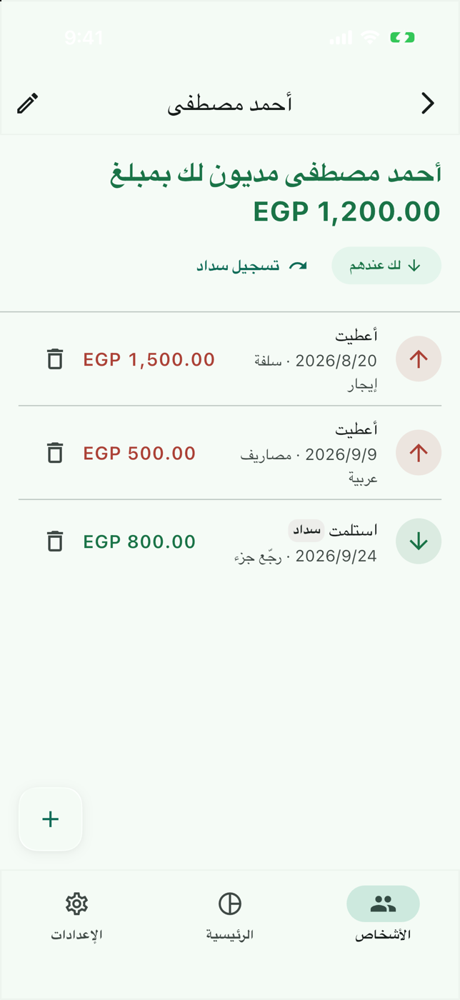
&nbsp;
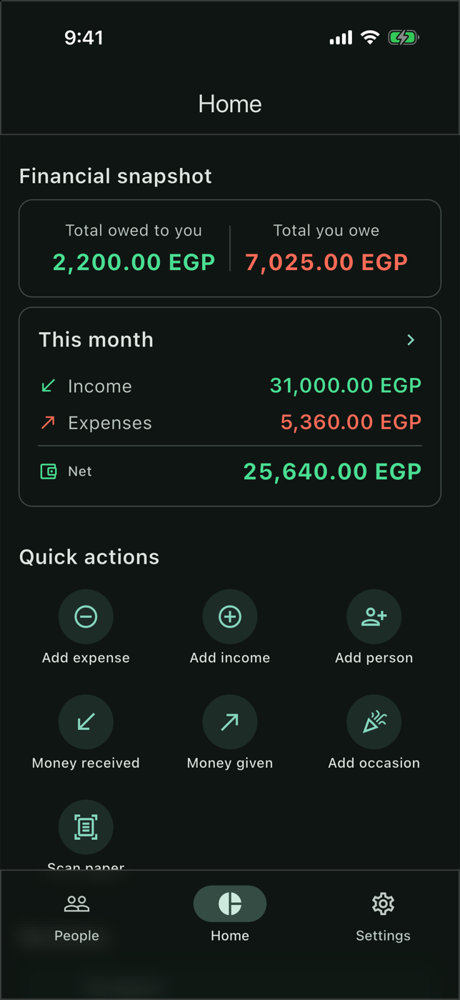

</div>

---

## Why Daftary?

In Egypt, a lot of everyday money moves informally between people: a loan to a friend, rent money a cousin covered, a wedding gift you'll return one day. Most people keep track of this in their heads or in a paper notebook (*daftar*). Expense trackers don't help, because they're built around **categories**, not **people**.

Daftary puts people at the center:

- Each person has a **running balance in both directions**: *they owe you*, *you owe them*, or *settled*.
- Partial repayments, multiple currencies and social occasions all roll into that one number.
- Personal finance tools (income and expenses, budgets, savings goals, reports) build on the same notebook without pushing the people-first core aside.

It's designed for people **with no accounting background**: plain language, calm visuals, and Arabic as a first-class right-to-left experience, not a mirrored translation.

## Features

| Area | What it does |
|---|---|
| 👥 **People & balances** | Add people, record money given or received, log partial repayments, and see each person's balance and full history. Warns about duplicate names. Archive and restore people. |
| 🏠 **Home dashboard** | Owed-to-you and you-owe totals, this month's income, expenses and net, quick actions, and entry points to every module. |
| 🎉 **Occasions** | Weddings, births and other social events: who gave what, who received what, the net per occasion, and photo attachments. |
| 💸 **Income & expenses** | Personal entries with custom categories, filters, a date range and per-category breakdowns, kept separate from money between people. |
| 📊 **Budgets** | Monthly planned vs. actual per category, over-budget warnings, and a trend chart across months. |
| 🎯 **Savings goals** | Goals with contributions and withdrawals, projected completion dates, and a "what if" calculator. |
| 📈 **Reports & export** | A 6-month income and expense trend, spending by category, and CSV export through the share sheet. |
| 📷 **Scan paper (OCR)** | Photograph an old paper notebook. On-device ML Kit text recognition turns it into candidate entries for you to review. Images never leave the device. |
| 🤖 **AI assistant** | Optional chat assistant that uses your own API key (OpenAI, Anthropic or Gemini), stored in secure storage. There is no Daftary backend in the middle. |
| 🔔 **Insights & reminders** | Local notifications calculated from your real data, with quiet hours, cooldowns and per-category controls. No generic or made-up "tips". |
| 📚 **Financial education** | A bundled offline library and calculators (compound growth, doubling time, savings rate). It's general education, never personalized advice. |
| 💱 **Multi-currency** | Every amount has an ISO 4217 currency. You enter exchange rates yourself. If a rate is missing, the total is blocked instead of guessed. |
| 🔒 **App lock** | PIN (hashed with PBKDF2) and biometrics, auto-lock on inactivity, and screenshot/recording protection. |
| ☁️ **Offline-first cloud sync** | Optional Supabase backup and sync across devices, built on an outbox, revision guards and manual conflict resolution for financial records. |
| 🌍 **Arabic / English, light / dark, Liquid Glass** | Full RTL, Arabic-Indic digit input, dark theme and an optional Liquid Glass UI. |

## Screenshots

<table>
  <tr>
    <td align="center">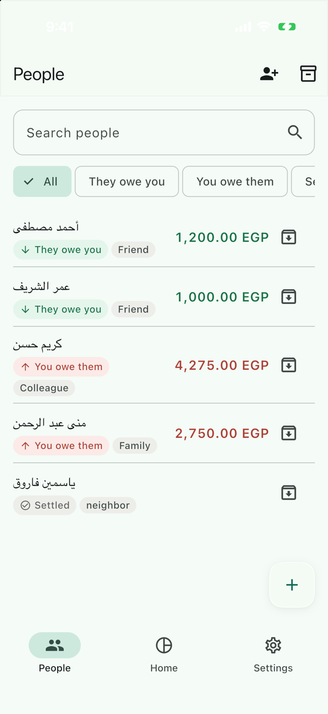<br/><sub>People & balances</sub></td>
    <td align="center">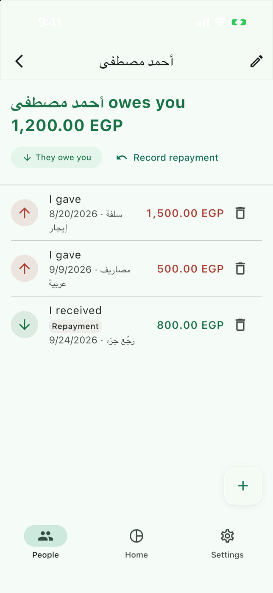<br/><sub>Person history</sub></td>
    <td align="center">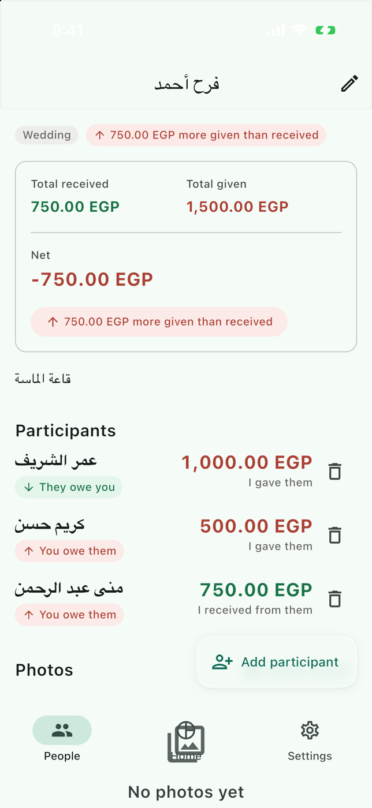<br/><sub>Occasion (wedding)</sub></td>
    <td align="center">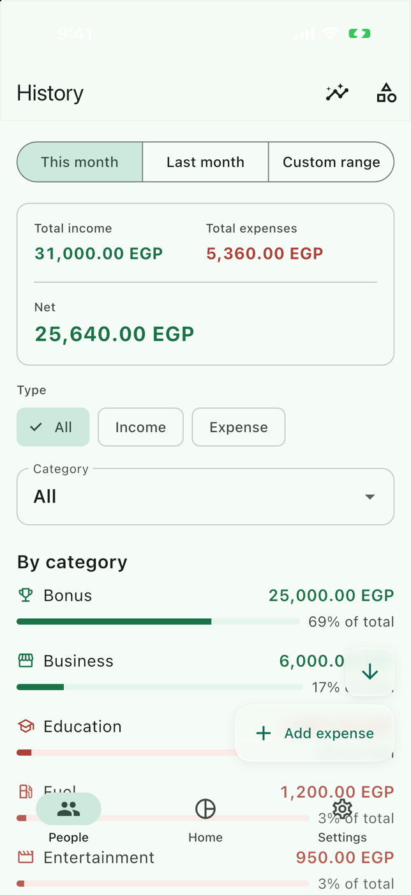<br/><sub>Income & expenses</sub></td>
  </tr>
  <tr>
    <td align="center">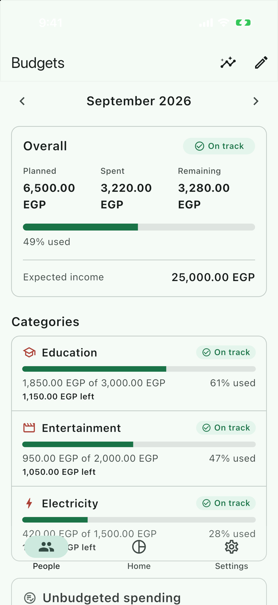<br/><sub>Monthly budget</sub></td>
    <td align="center">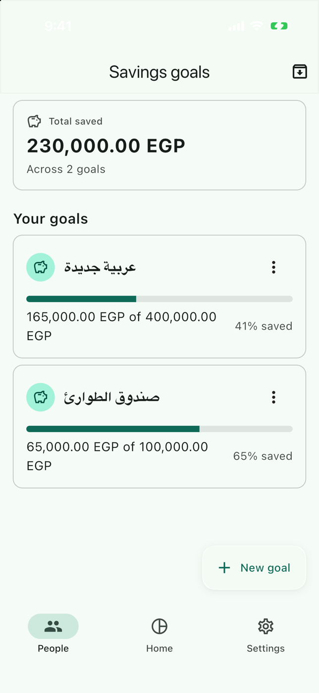<br/><sub>Savings goals</sub></td>
    <td align="center">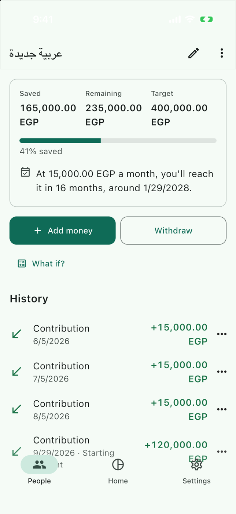<br/><sub>Goal detail & projection</sub></td>
    <td align="center">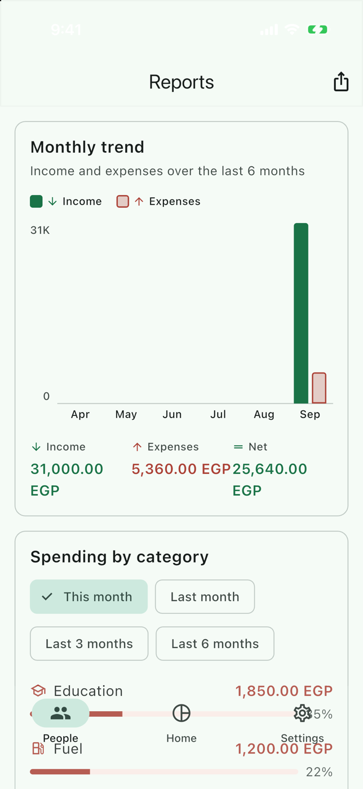<br/><sub>Reports</sub></td>
  </tr>
  <tr>
    <td align="center">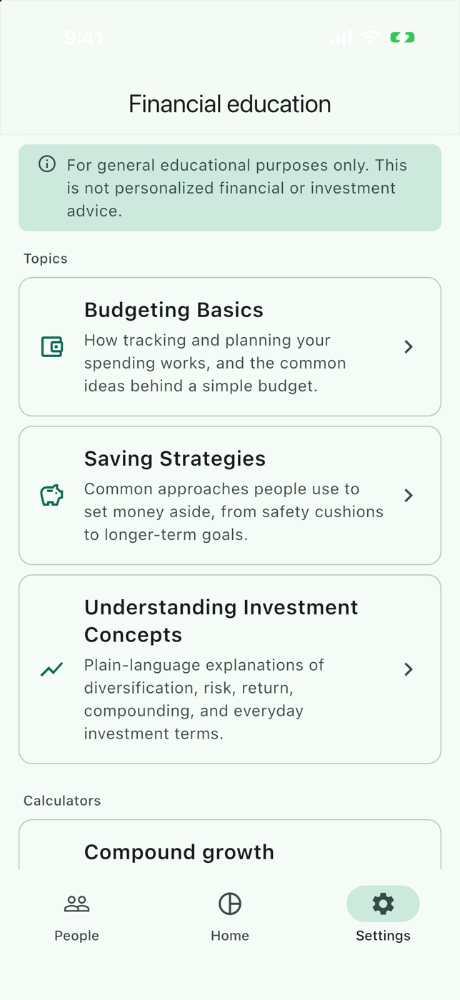<br/><sub>Financial education</sub></td>
    <td align="center">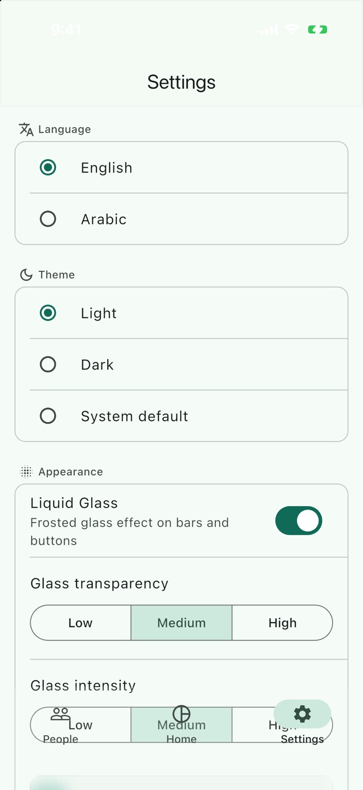<br/><sub>Settings</sub></td>
    <td align="center">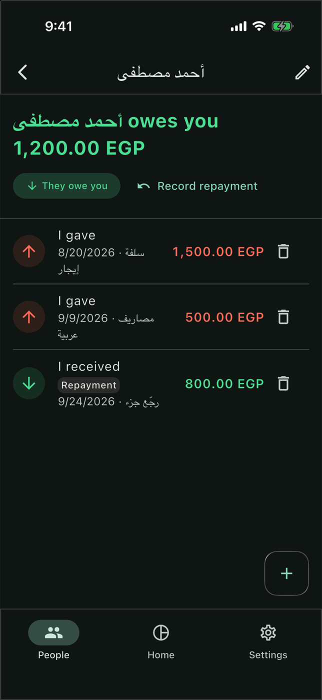<br/><sub>Dark mode</sub></td>
    <td align="center">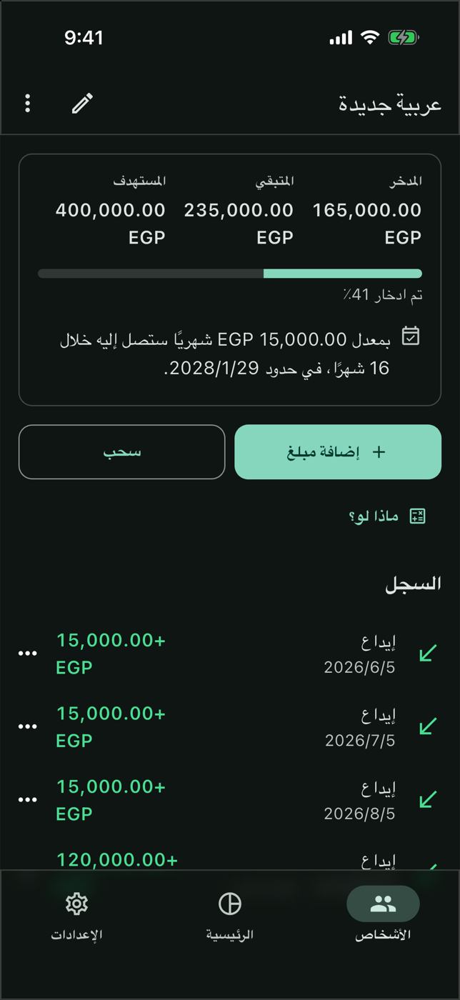<br/><sub>Savings goal (Arabic, dark)</sub></td>
  </tr>
</table>

### Arabic (RTL)

<table>
  <tr>
    <td align="center">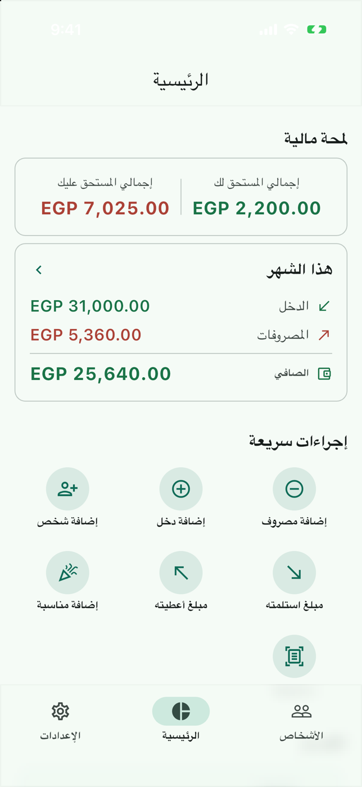<br/><sub>الرئيسية</sub></td>
    <td align="center">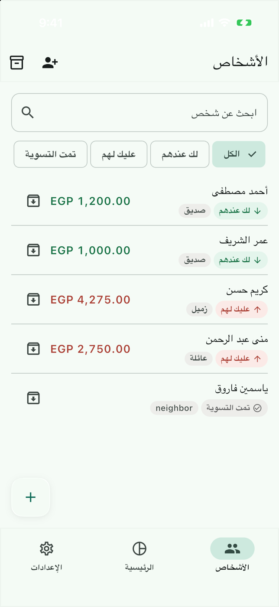<br/><sub>الأشخاص</sub></td>
    <td align="center">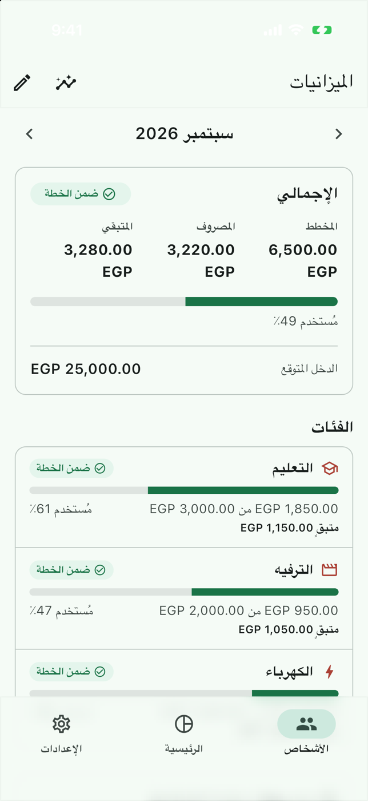<br/><sub>الميزانية</sub></td>
    <td align="center">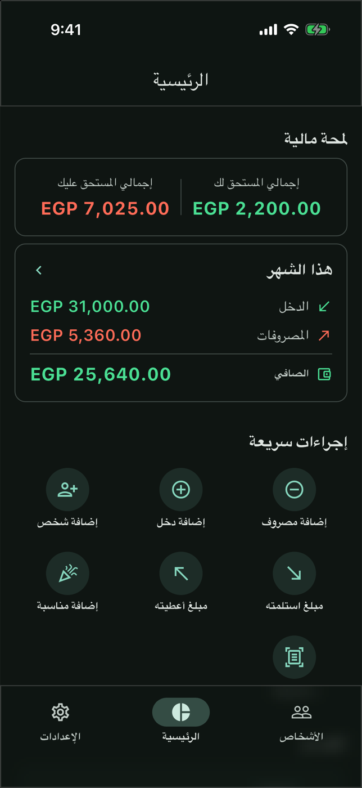<br/><sub>الوضع الداكن</sub></td>
  </tr>
</table>

## Architecture

Daftary follows **Clean Architecture, split by feature**. Each of the 18 feature modules has its own `data / domain / presentation` layers. Shared pieces such as the database, sync engine, DI, routing, design system and money types live in `lib/core`.

### High-level overview

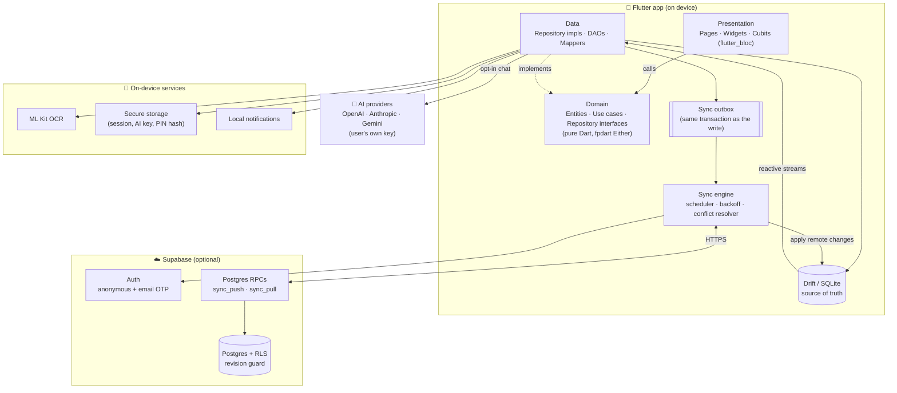
```mermaid
flowchart TB
    subgraph Device["📱 Flutter app (on device)"]
        direction TB
        UI["Presentation<br/>Pages · Widgets · Cubits (flutter_bloc)"]
        DOMAIN["Domain<br/>Entities · Use cases · Repository interfaces<br/>(pure Dart, fpdart Either)"]
        DATA["Data<br/>Repository impls · DAOs · Mappers"]
        DB[("Drift / SQLite<br/>source of truth")]
        OUTBOX[["Sync outbox<br/>(same transaction as the write)"]]
        SYNC["Sync engine<br/>scheduler · backoff · conflict resolver"]

        UI -->|calls| DOMAIN
        DATA -.->|implements| DOMAIN
        DATA --> DB
        DATA --> OUTBOX
        OUTBOX --> SYNC
        SYNC -->|apply remote changes| DB
        DB -->|reactive streams| DATA
    end

    subgraph Cloud["☁️ Supabase (optional)"]
        AUTH["Auth<br/>anonymous + email OTP"]
        RPC["Postgres RPCs<br/>sync_push · sync_pull"]
        PG[("Postgres + RLS<br/>revision guard")]
        RPC --> PG
    end

    subgraph OnDevice["🔐 On-device services"]
        MLKIT["ML Kit OCR"]
        SECURE["Secure storage<br/>(session, AI key, PIN hash)"]
        NOTIF["Local notifications"]
    end

    AI["🤖 AI providers<br/>OpenAI · Anthropic · Gemini<br/>(user's own key)"]

    SYNC <-->|HTTPS| RPC
    SYNC --> AUTH
    DATA --> MLKIT
    DATA --> SECURE
    DATA --> NOTIF
    DATA -->|opt-in chat| AI
```

### Layering inside a feature

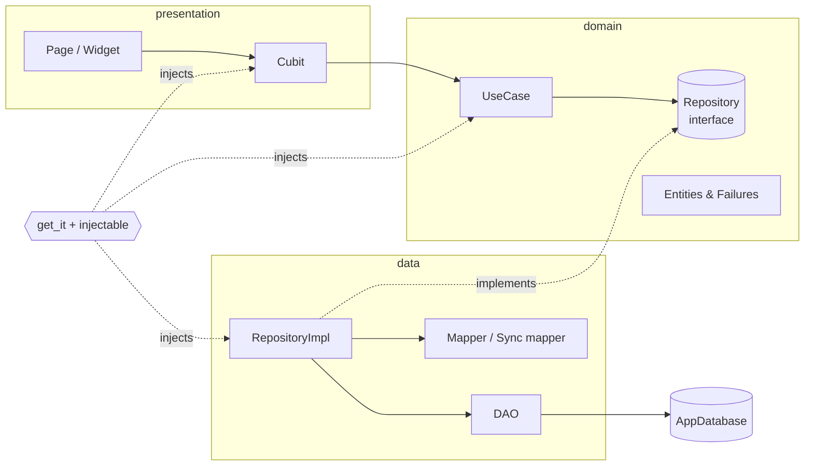
```mermaid
flowchart LR
    subgraph presentation
        P[Page / Widget] --> C[Cubit]
    end
    subgraph domain
        U[UseCase] --> R[(Repository<br/>interface)]
        E[Entities & Failures]
    end
    subgraph data
        RI[RepositoryImpl] --> D[DAO]
        RI --> M[Mapper / Sync mapper]
    end
    C --> U
    RI -. implements .-> R
    D --> DB[(AppDatabase)]
    GI{{"get_it + injectable"}} -. injects .-> C & U & RI
```

- **State management:** `flutter_bloc` Cubits. Screens listen to reactive Drift streams, so every screen updates by itself when data changes locally or through sync.
- **Error handling:** repositories return `Either<Failure, T>` (fpdart). Each feature has typed failures, which the UI turns into localized messages.
- **Money:** always stored as **integer minor units plus an explicit currency**. No floating-point amounts.
- **Navigation:** `go_router` with a `StatefulShellRoute` (People · Home · Settings), so every tab keeps its own navigation stack.
- **Dependency injection:** `get_it` + `injectable` (code-generated).

### Offline-first sync flow

The local database is always the source of truth. The app works fully without a network or an account, and sync is an optional extra.

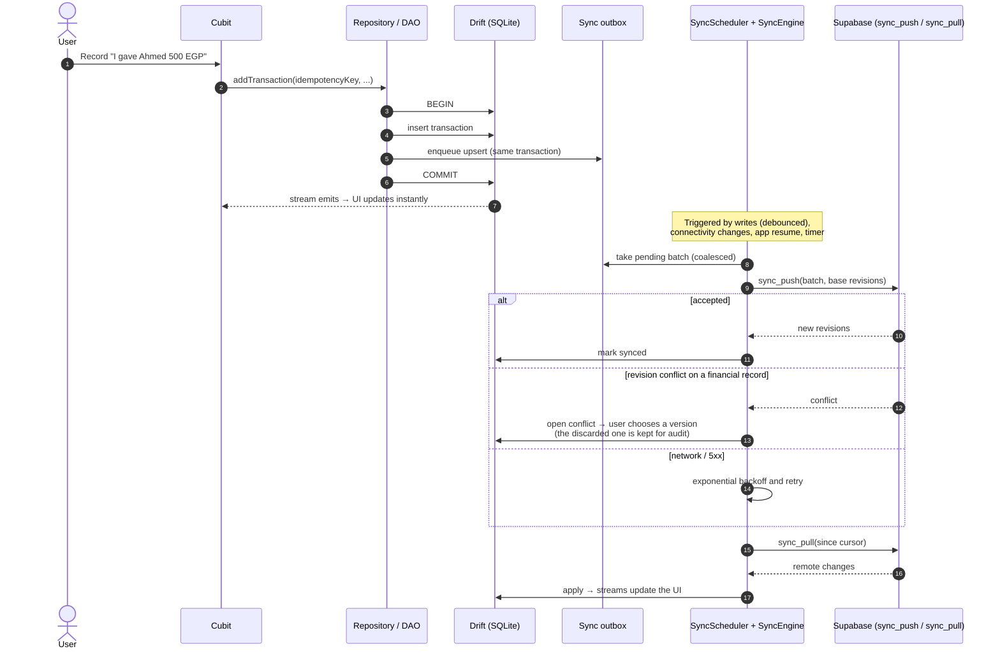
```mermaid
sequenceDiagram
    autonumber
    actor User
    participant Cubit
    participant Repo as Repository / DAO
    participant DB as Drift (SQLite)
    participant Outbox as Sync outbox
    participant Engine as SyncScheduler + SyncEngine
    participant SB as Supabase (sync_push / sync_pull)

    User->>Cubit: Record "I gave Ahmed 500 EGP"
    Cubit->>Repo: addTransaction(idempotencyKey, ...)
    Repo->>DB: BEGIN
    Repo->>DB: insert transaction
    Repo->>Outbox: enqueue upsert (same transaction)
    Repo->>DB: COMMIT
    DB-->>Cubit: stream emits → UI updates instantly

    Note over Engine: Triggered by writes (debounced),<br/>connectivity changes, app resume, timer
    Engine->>Outbox: take pending batch (coalesced)
    Engine->>SB: sync_push(batch, base revisions)
    alt accepted
        SB-->>Engine: new revisions
        Engine->>DB: mark synced
    else revision conflict on a financial record
        SB-->>Engine: conflict
        Engine->>DB: open conflict → user chooses a version<br/>(the discarded one is kept for audit)
    else network / 5xx
        Engine->>Engine: exponential backoff and retry
    end
    Engine->>SB: sync_pull(since cursor)
    SB-->>Engine: remote changes
    Engine->>DB: apply → streams update the UI
```

## Tech stack

| Concern | Choice |
|---|---|
| UI | Flutter 3.47, Material 3, `liquid_glass_widgets`, `fl_chart` |
| State | `flutter_bloc` (Cubit), `equatable` |
| Navigation | `go_router` (`StatefulShellRoute`) |
| Persistence | `drift` + SQLite (schema v11, with tested migrations) |
| DI | `get_it` + `injectable` |
| Functional errors | `fpdart` (`Either<Failure, T>`) |
| Backend (optional) | Supabase: Auth, Postgres RPCs, Row-Level Security, SQL migrations + pgTAP tests |
| Security | `flutter_secure_storage`, `local_auth`, PBKDF2 via `crypto` |
| On-device ML | `google_mlkit_text_recognition`, `image_cropper`, `image` |
| i18n | `flutter_localizations` + `intl`, ~1,000 strings in each of Arabic and English |
| Notifications | `flutter_local_notifications` + `timezone` |
| Testing | `flutter_test`, `bloc_test`, `mocktail`, `fake_async`, `integration_test` |

## Project structure

```text
lib/
├── core/
│   ├── database/        # Drift AppDatabase, migrations, balance queries
│   ├── sync/            # Outbox, engine, scheduler, conflict resolver, Supabase data sources
│   ├── design_system/   # Tokens + shared components (AppCard, AppButton, CurrencyPicker…)
│   ├── money/           # Money (minor units + currency), formatters, Arabic-digit parser
│   ├── routing/         # go_router config, main shell, notification deep links
│   ├── security/        # App lock gate, lifecycle observer, screenshot protection
│   └── di/  l10n/  config/  error/  date/  media/ …
│
└── features/
    ├── people/  transactions/  occasions/            # the people-first core
    ├── finance/  budgets/  savings/  dashboard/      # personal finance
    ├── ocr/  ai_assistant/  insights_notifications/  financial_education/
    ├── currency/  data_privacy/  app_lock/  cloud_sync/
    └── settings/  onboarding/  startup/
        └── <feature>/{data, domain, presentation}

supabase/
├── migrations/          # Tables, RLS policies, sync_push / sync_pull RPCs, revision guard
└── tests/               # pgTAP tests for RLS, push/pull and security hardening

specs/                   # One spec-kit folder per feature (spec, plan, research, tasks)
test/                    # Unit, cubit, widget and performance tests
integration_test/        # End-to-end flows on a real device/simulator
```

## How it was built: spec-driven development

Every feature (`001` to `021`) went through a written **spec → plan → research → tasks → implementation** cycle using [Spec Kit](https://github.com/github/spec-kit). All of it is in [`specs/`](specs/), from the core money-relationships tracker to offline-first sync. Each spec records the functional requirements, edge cases and design decisions behind the code, and the code comments point back to them (e.g. `FR-017`, `research.md Decision 7`).

## Testing

- **~380 unit / cubit / widget test files** covering domain logic, repositories, DAOs, cubits and screens, including RTL, dark mode and Liquid Glass variants.
- **21 integration test flows** that run the real app, with real DI and real SQLite, end to end.
- **Performance tests** for large data sets (people list, overview, OCR batches, sync upload).
- **Database tests** for Postgres RLS, the sync RPCs and revision guards (`supabase/tests`).

```sh
fvm flutter test                          # unit + widget
fvm flutter test integration_test -d <device>
```

## Try it

- **Android:** download the latest APK from [Releases](https://github.com/AbdallahRehab/Daftary/releases/latest). Pick `-arm64.apk`, open it on your phone and allow "Install unknown apps".
- **iPhone:** a public TestFlight beta is coming soon.

## Getting started

**Requirements:** [FVM](https://fvm.app) (the project pins Flutter 3.47.0), Xcode and/or Android Studio.

```sh
git clone https://github.com/AbdallahRehab/Daftary.git
cd Daftary
fvm install
fvm flutter pub get
fvm dart run build_runner build --delete-conflicting-outputs
fvm flutter run
```

The app runs **fully offline** by default. To turn on cloud sync, copy `config/supabase.example.json` to `config/supabase.dev.json`, add your Supabase URL and publishable key, apply the migrations in `supabase/migrations`, and run:

```sh
fvm flutter run --dart-define-from-file=config/supabase.dev.json
```

### Releasing the Android APK

Pushing a version tag builds a signed APK in GitHub Actions ([release-android.yml](.github/workflows/release-android.yml)) and attaches it to a GitHub Release:

```sh
git tag v1.0.0 && git push origin v1.0.0
```

The workflow needs the `ANDROID_KEYSTORE_BASE64`, `ANDROID_KEYSTORE_PASSWORD`, `ANDROID_KEY_PASSWORD` and `ANDROID_KEY_ALIAS` repository secrets. `SUPABASE_URL` and `SUPABASE_PUBLISHABLE_KEY` are optional: without them the APK runs local-only. For a local release build, put the keystore at `android/upload-keystore.jks` and its details in `android/key.properties` (both gitignored). Without them, release builds are signed with the debug key.

### Regenerating the screenshots

The screenshots in this README come from the real app, filled with demo data on an in-memory database:

```sh
tool/readme_screenshots.sh <booted-ios-simulator-udid>
```

## Author

**Abdallah Rehab**, Flutter developer
[GitHub](https://github.com/AbdallahRehab)
