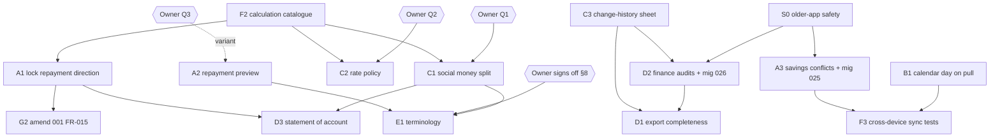

# Implementation Plan: Financial Trust Audit

**Branch**: `022-financial-trust-audit` | **Date**: 2026-10-05 | **Spec**: [spec.md](spec.md)

**Input**: Feature specification from `/specs/022-financial-trust-audit/spec.md`

## Summary

There are two tracks.

**Track 1 is this feature as specified.** It produces `audit.md`, the 20-section audit plus "DECISIONS REQUIRED FROM ME", using the verified evidence in [research.md](research.md). It changes no code.

**Track 2 is the remediation plan** the user asked for, grouped A–H. Each item is grounded in a root cause that was checked in the code (research.md). Track 2 changes application behavior. That is now in scope: the owner asked for the remediation tasks (S1 answered 2026-10-05, spec FR-002). The scope excludes C1, C2 and the A2 blocking variant until Q1–Q3 are decided. Every sync change follows the **release order** in "Sync rollout order" below, so installed v1.0.1 apps keep syncing.

Baseline: `main` at v1.0.1, with **3,699 tests passing** (`flutter test`, 2026-10-05). No existing test catches any defect in A or B.

## Technical Context

**Language/Version**: Dart ^3.10, Flutter 3.47.0 (fvm)

**Primary Dependencies**: flutter_bloc (Cubit), drift (SQLite), get_it + injectable, go_router, fpdart `Either`, supabase_flutter (optional sync), intl / gen_l10n

**Storage**: Local Drift/SQLite as the source of truth. Optional Supabase Postgres sync through an outbox and a revision-based push/pull RPC (021–024).

**Testing**: `flutter test` (unit, Cubit, widget, golden RTL/theme, performance), `integration_test/`, and fake-remote sync tests (`test/core/sync/fakes`)

**Target Platform**: Android (primary) and iOS, Material 3

**Project Type**: Mobile app, local-first, with an optional cloud backend

**Performance Goals**: No regression to the existing performance tests (`test/performance/*`). Balance and overview watch queries stay under the current debounce budget.

**Constraints**: Offline-first. Money in integer minor units. No second state-management approach. No edits to applied migrations; forward migrations only. The user runs `supabase db push` themselves.

**Scale/Scope**: 18 feature modules, about 750 Dart files, 14 synced entity types

## Constitution Check

*GATE: Must pass before Phase 0 research. Re-checked after Phase 1 design.*

| Principle | Check | Result |
| --- | --- | --- |
| I/II Layering and feature-first | Every fix stays inside its owning feature (transactions, finance, savings, data_privacy, cloud_sync). Only `SyncWire` lives in `core/sync`, and it is already shared. | ✅ |
| III/IV BLoC, immutable state | Only existing Cubits change; new fields go through `copyWith`. No new state approach. | ✅ |
| V Domain logic | The repayment-direction rule goes into the repository and use case, not the widget (R1). | ✅ |
| VI Repository | New reads (audit history) go behind the existing repository contracts. | ✅ |
| VII Errors | Guards return a typed `ValidationFailure` that maps to localized copy. | ✅ |
| VIII Deterministic money | No new calculation uses doubles. The C2 decision keeps integer rate micros. | ✅ |
| XI Idempotent sync | R3 *extends* manual conflicts to savings contributions. R2 only changes how a field is read on pull. | ✅ |
| XIII l10n/RTL | Every new or changed string goes into both ARB files and gets RTL golden coverage. | ✅ |
| Financial Domain Override | A1/A2 stop silent ledger distortion. C3 makes change history visible. | ✅ |
| Scope (spec FR-002) | Track 2 changes code only as `contracts/behavior-changes.md` allows (S1 answered). | ✅ |
| XI, older installed apps | Every server change (025, 026) is released after the client change that understands it (see "Sync rollout order"). | ✅ |
| Accessibility | New dialogs and sheets get screen-reader label and 48dp touch-target tests (A2, C3, E3, C4). | ✅ |
| No duplicated code | One generic `ChangeHistoryCubit` serves transactions, savings contributions and finance entries. | ✅ |

**Post-design re-check (after Phase 1)**: no new violations. The design adds one forward migration (R3), no new tables except the optional `finance_entry_audits` (D2), and no new dependencies.

## Project Structure

### Documentation (this feature)

```text
specs/022-financial-trust-audit/
├── spec.md
├── preliminary-findings.md   # seeds (all resolved in research.md)
├── research.md               # Phase 0: verified root causes and decisions
├── plan.md                   # this file
├── data-model.md             # Phase 1: audit entities and minimal model changes
├── contracts/
│   ├── audit-report.md       # required structure of audit.md
│   └── behavior-changes.md   # before/after contracts for every Track 2 change
├── quickstart.md             # how to validate both tracks
├── checklists/requirements.md
└── audit.md                  # Track 1 deliverable (written in /speckit-implement)
```

### Source Code (touched by Track 2 only)

```text
lib/core/sync/sync_mapper_registry.dart                 # SyncWire: add calendar-day parse (B1)
lib/core/sync/remote/sync_remote_data_source.dart       # skip unknown entity types (S0)
lib/core/sync/local/sync_local_store.dart               # one-time re-pull for the B1 repair
lib/core/l10n/app_{ar,en}.arb                           # terminology (E1), new copy (A2, C3, E2, E3)
lib/features/transactions/
  data/repositories/transactions_repository_impl.dart   # A1 guard, C3 audit read, B2 fallback
  data/sync/money_transaction_sync_mapper.dart          # B1
  domain/repositories/transactions_repository.dart      # C3 watchAuditHistory
  domain/usecases/watch_transaction_audit_history.dart  # C3 (new)
  presentation/pages/transaction_form_page.dart         # A1 read-only direction, E3
  presentation/cubit/transaction_form_cubit.dart        # A1, E3
  presentation/pages/repayment_form_page.dart           # A2 preview and confirm
  presentation/cubit/repayment_form_{cubit,state}.dart  # A2
  presentation/widgets/transaction_history_sheet.dart   # C3 (new)
lib/features/finance/data/sync/finance_entry_sync_mapper.dart   # B1
lib/features/finance/...                                # D2 (if approved)
lib/features/cloud_sync/presentation/widgets/conflict_*.dart    # A3 render savings contributions
lib/features/data_privacy/domain/usecases/export_user_data.dart # D1
supabase/migrations/2026100xxxxxxx_025_savings_contribution_conflicts.sql  # A3
PRODUCT.md, specs/001-…/spec.md                         # G1, G2
test/…                                                  # F1–F3 mirror the paths above
```

**Structure Decision**: the existing feature-first layout is reused unchanged. No new module.

---

## Remediation Plan (Track 2)

Severity follows the spec's Clarifications tie-break. Each item: **Problem · Root cause · Solution · Layers · Files · Depends on · Risk · Tests · Rollback**.

### A. Critical financial correctness fixes

**A1 — A repayment can be edited into a new debt (P0, Bug)** · research PF-02
- **Problem**: Editing a "سداد" and flipping it to given/received in the debt's own direction makes the debt grow by twice the amount, and the row is still labelled a repayment.
- **Root cause**: 001 FR-015 allows editing direction with no exception for repayments. `TransactionFormPage` always enables the direction `SegmentedButton`. `TransactionsRepositoryImpl.editTransaction` writes `direction` without checking `existing.kind`.
- **Solution**: (1) Repository: if `existing.kind == repayment && direction.dbValue != existing.direction`, return `ValidationFailure`. (2) Form: when `isEditMode && kind == repayment`, show direction read-only with a short explanation ("اتجاه السداد بيتحدد تلقائيًا"). (3) The cubit keeps the original direction for repayments. Initial exchanges and occasion contributions keep editable direction (001 FR-015 is unchanged for them).
- **Layers**: Data, Presentation · **Files**: `transactions_repository_impl.dart`, `transaction_form_page.dart`, `transaction_form_cubit.dart`, ARB
- **Depends on**: none · **Risk**: Low. Existing repayment rows are untouched. Rows that were already flipped stay as they are (the audit counts them; see quickstart).
- **Tests**: a repository test that rejects a direction change on a repayment and allows amount/date/note changes; a widget test that direction is disabled for a repayment in AR and EN; a regression test that an initial exchange's direction is still editable.
- **Rollback**: Revert the commit. No data or schema change.

**A2 — An over-repayment silently reverses who owes whom (P1, Missing requirement)** · PF-01
- **Problem**: A repayment larger than the outstanding amount flips the balance (allowed by 001 FR-012), but the form shows neither the outstanding amount nor the result.
- **Root cause**: `RepaymentFormCubit` never loads the person's balance, and the form has no preview.
- **Solution (works under any Q3 answer)**: The cubit watches `WatchPersonBalance` and exposes `outstanding` and `resultingBalance`, computed by a pure function over integer minor units in the Domain layer. **Currency rule**: the balance is in the primary currency, so a repayment in another currency is converted with the *same* rates (`ConversionContext`) the balance uses before it is subtracted. If the repayment's currency has no rate, the preview is `blocked`: no number is shown, and saving still works. For example, with 10,000.00 EGP owed and a repayment of 100.00 USD at 48.50, the result is 5,150.00 EGP still owed. The form shows "المتبقي عليه: X". When the amount is larger than the outstanding amount, it shows a confirmation dialog: "كده هيبقى ليه عندك Y — متأكد؟". If the balance is blocked on a rate, show the per-currency outstanding amounts and skip the preview text. **If Q3 = "block over-repayment"**, the same seam becomes a validation error instead of a dialog.
- **Layers**: Domain (pure helper), Presentation · **Files**: `repayment_form_{cubit,state,page}.dart`, a new `domain/services/repayment_preview.dart`, ARB
- **Depends on**: Q3 only for the variant · **Risk**: Low/Medium. The balance stream has to be ready before submit; the submit button stays disabled until it is.
- **Tests**: table-driven unit tests for the preview (owes 1,000, repay 400 → 600; repay 1,000 → settled; repay 1,500 → flips to 500 the other way; blocked rate); Cubit tests; a widget test that the dialog appears only when the amount exceeds the outstanding balance.
- **Rollback**: Revert. UI and domain only.

**A3 — Savings contributions edited on two devices silently overwrite each other (P0 per the sync rule, Bug)** · PF-11
- **Problem**: When two offline devices edit the same contribution, the last one to sync wins without telling anyone. Savings progress changes without explanation.
- **Root cause**: Migration 023's push RPC gives `savings_contribution` the `lww` policy, because the conflict UI "only knows money transactions and finance entries".
- **Solution**: (1) A forward migration `025_savings_contribution_conflicts.sql` replaces the push function and sets `savings_contribution` to `v_policy := 'financial'` (the same code path as `finance_entry`). (2) Client: `SyncConflictItem` and `conflict_resolution_sheet.dart` render a savings contribution (goal name, amount, date for both sides). `ConflictResolver` already works per entity type, and the savings mapper is already registered.
- **Layers**: Backend, Data, Presentation · **Files**: new migration, `cloud_sync/domain/entities/sync_conflict_item.dart`, `cloud_sync/data/repositories/cloud_sync_repository_impl.dart`, `conflict_resolution_sheet.dart`, ARB
- **Depends on**: S0. **The user deploys the migration** (`supabase db push`) after release R1. The financial policy applies only to app versions R1 and later (`p_app_version`). v1.0.1 keeps last-write-wins, because it can't display a savings conflict (S0 b).
- **Risk**: Medium. The RPC function is replaced. It must be copied exactly from 024's latest version with only the one-line policy change; the diff is reviewed.
- **Tests**: a fake-remote sync test (two edits against a stale base → a conflict is recorded → keepMine and keepTheirs each keep the other side in `conflict_resolutions`); a widget test of the sheet for a savings item; a SQL check in quickstart.
- **Rollback**: A follow-up migration that restores the 024 function body. Rows already resolved stay valid.

### B. Functional bugs

**B1 — A date can show one day off on a device in another time zone (P2, Bug)** · PF-08
- **Problem**: A transaction or expense dated 1 Oct on a UTC+3 phone shows as 30 Sep on a UTC+2 device, and moves to the previous month in budgets and reports.
- **Root cause**: `MoneyTransactionSyncMapper.fromWire` and `FinanceEntrySyncMapper.fromWire` rebuild `date` from the `occurred_at` instant, ignoring the `occurred_on` calendar day that is already sent.
- **Solution**: Add `SyncWire.parseLocalDay(json)`, which returns local-midnight millis of `occurred_on` and falls back to `occurred_at`. Use it in both mappers. Savings contributions send no calendar day, so they are deferred to G3.
- **Layers**: Data (sync) · **Files**: `sync_mapper_registry.dart`, the two mappers
- **Depends on**: none · **Risk**: Low. The fallback keeps old server rows readable.
- **Tests**: mapper tests run under `TZ=UTC` (and in CI): a row from +180 read at +120 keeps its day; a month boundary on the 1st stays in the same month; a missing `occurred_on` falls back.
- **Repair of rows already downloaded**: downloaded records are never fetched again (the download position only moves forward), so rows shifted before the fix stay wrong. A one-time repair resets the download position to 0 the first time the fixed app syncs, which re-applies every server row through the fixed mapper. The applier already skips rows with pending local changes or open conflicts, so local work is never overwritten. It is guarded by a stored flag so it runs once. The cost is one full download, done in the existing pages.
- **Rollback**: Revert. The repair flag is harmless if the code is reverted.

**S0 — Older apps must survive new sync data (P0, Bug)** · analysis C1/C2
- **Problem**: (a) When the download meets a record type the app doesn't know, it throws `FormatException('pull: unknown entity_type')` and the whole page fails (`sync_remote_data_source.dart:104-106`). So D2's new `finance_entry_audit` would stop every v1.0.1 install on that account from downloading. (b) If the server reports a conflict on a type the app's conflict screen can't show (A3's savings contributions), a v1.0.1 app parks the edit where nothing ever shows it (`sync_local_store.dart` `_block` plus the `ConflictEntityType.tryFromWire` filter), so the edit never syncs.
- **Root cause**: Installed apps can't be changed. The server sends every type to every app and applies one conflict policy to every app version.
- **Solution (server protects old apps; client protects future ones)**:
  1. *Server, migration 025*: `sync_push` already receives `p_app_version`. `savings_contribution` uses `v_policy := 'financial'` only when `p_app_version` is at least the first release that contains the A3 client (`R1`, compared as semantic versions by a small helper function). Otherwise it stays `lww`, exactly as today. Old apps keep today's behavior, and new apps get conflicts they can show.
  2. *Server, migration 026*: the existing `sync_pull(bigint, int)` keeps returning exactly today's set of types, so `finance_entry_audit` is **excluded**. A new `sync_pull_v2(bigint, int)` returns every type, and apps from R2 on call it. The revision cursor stays valid for both, because rows are still returned in revision order.
  3. *Client, R1*: `_parseChange` returns `null` for an unknown `entity_type`. The page skips it, logs `SyncEvent.unknownEntitySkipped` with no row data, and still advances the cursor. Any type added in future is then harmless to R1 and later apps.
- **Sync rollout order** (binding; revised 2026-10-06): one release, because the B1 repair needs the v12 schema that comes with D2.
  1. Deploy migration 025.
  2. Deploy migration 026.
  3. Release 1.1.0 (S0, A3 client, B1 + repair, D2, everything else).
  Both migrations are safe before any 1.1.0 install exists (025 gates on `p_app_version`; 026 leaves `sync_pull` unchanged and adds `sync_pull_v2`). Shipping the app before 026 is deployed would make every download fail (`sync_pull_v2` missing), so the order is mandatory.
- **Layers**: Data (sync), Backend · **Files**: `lib/core/sync/remote/sync_remote_data_source.dart`, `lib/core/sync/sync_logger.dart`, migrations 025/026
- **Risk**: Low. Skipping is safe, because an unknown type has no local table. The server version check is one comparison.
- **Tests**: a fake-remote test where a pull page containing an unknown type is applied apart from that row and the cursor advances. A SQL check that an old `p_app_version` still gets `lww` for savings and a new one gets `conflict`. A SQL check that `sync_pull` never returns `finance_entry_audit` while `sync_pull_v2` does.
- **Rollback**: Revert the client. 025 and 026 can each be replaced by a forward migration restoring the previous function bodies.
  - *Migration 025 also filters `sync_pull`*: `conflict_resolution` rows with an `entity_type` other than `money_transaction` or `finance_entry` are not served, because v1.0.1's mapper rejects them. When v1.0.1 is retired, a later migration drops this filter and bumps those rows' revisions (a no-op update firing `sync_stamp`), otherwise devices past the cursor never receive them.

**B2 — Repayment direction in a rare blocked-currency case (P3, Bug)** · RF-04
- **Solution**: In `_repaymentDirection`, when the status is unknown *and* the repayment currency has no net, return `RatesMissingFailure(missingRatesFor)` (shown as the existing rate-needed message) instead of defaulting to "given". **Files**: `transactions_repository_impl.dart` · **Tests**: a repository unit test · **Rollback**: Revert.

### C. Missing business requirements

**C1 — Separate social money (نقطة) from loans (P1) — blocked on Owner decision Q1**
- **Root cause**: PF-03. Occasion contributions default to `counts_toward_balance = true`.
- **Solution, if Q1 = B (recommended)**: add no column. Split the existing aggregation into `loanNet` (all rows except occasion contributions) and `socialNet` (occasion contributions where `counts_toward_balance = 1`). `PersonBalance` gains `socialNet`. Person detail and overview show "مجاملات" as a separate line. Status badges stay loan-only. **If Q1 = A**: copy only (E1). **If Q1 = C**: change the default of `counts_toward_balance` in `ParticipantFormCubit` for new rows only; history is unchanged.
- **Layers**: Data (`balance_queries.dart`), Domain (`PersonBalance`, `OverviewSummary`), Presentation · **Risk**: Medium/High: this is the most-read path in the app. **Tests**: the full calculation catalogue (F2) must pass before and after; new split tests. **Rollback**: Revert. There is no data migration, so it rolls back cleanly.

**C2 — One exchange-rate policy everywhere (P1) — blocked on Owner decision Q2**
- **Root cause**: PF-04. Most totals revalue at the current rate, while savings locks the rate at contribution time.
- **Recommended solution (Q2 = hybrid)**: what is *owed* (person balances, occasion nets) is valued at today's rate, which is correct for money still outstanding, and labelled "بسعر النهارده". Income, expense and budget *history* is valued at the rate on the entry date. That needs `rate_micros_at_entry` on finance entries, filled from the current rate at creation and backfilled for old rows with the current rate (labelled as such). That is a schema migration plus a sync field.
- **Depends on**: Q2, and F2 for regression · **Risk**: High (schema and sync). Delivered as its own feature.

**C3 — Show a transaction's change history (P2)** · PF-05
- **Solution**: Add `TransactionsRepository.watchAuditHistory(transactionId)` and a `WatchTransactionAuditHistory` use case. Tapping an "معدّلة" marker opens a bottom sheet listing created, edited and deleted entries with the old and new amount, direction, date and note. This is read-only. One generic `ChangeHistoryCubit` (it takes the history stream to show) drives the sheet for transactions, savings contributions (over `SavingsContributionAudits`) and finance entries (D2). The sheet has screen-reader labels and 48dp targets.
- **Layers**: Domain, Data, Presentation · **Risk**: Low (read-only) · **Tests**: repository, Cubit, widget (RTL render/semantic assertions; repo has no image goldens, CI is ubuntu) · **Rollback**: Revert.

**C4 — Possible-duplicate warning for a transaction (P3, Improvement)** · RF-05
- **Solution**: Before `addTransaction`, check for an active row with the same person, amount, currency, direction and date. If one exists, show the existing `duplicate_warning_sheet` pattern ("سجلت نفس المبلغ النهارده — تسجله تاني؟"). The user can always continue. **Risk**: Low.

### D. Accounting and reporting improvements

**D1 — Complete the data export (P2)** · RF-03
- **Solution**: Extend `ExportUserData` with sections for occasions, budgets and allocations, savings goals and contributions, exchange rates, and transaction and contribution change history, using the existing repository reads. Keep the CSV section format and the `.part` file followed by a rename. **Files**: `export_user_data.dart`, `contracts` in 013 · **Tests**: extend `export_read_only_test` and `export_no_network_test`, plus a section-count test · **Rollback**: Revert.

**D2 — Change history for income and expense (P1: constitution Financial Domain Override)** · RF-02
- **Solution**: Add a `finance_entry_audits` table (append-only, mirroring `TransactionAuditEntries`). It is written in the same Drift transaction as each create, edit, delete or restore, with the change types `created`, `edited`, `deleted` and `restored`. Add a new synced entity type `finance_entry_audit` using the `append` policy in migration 026, and reuse the C3 sheet.
- **Depends on**: C3, S0. Follows the sync rollout order: 026 is deployed before the R2 release, because otherwise the server rejects the unknown `entity_type` as a permanent failure and the outbox entry is marked failed (`sync_local_store.dart` `_fail`). Old apps never receive these rows (`sync_pull` excludes them; S0 2).
- **Risk**: Medium (schema, sync, migration test) · **Rollback**: A forward migration can leave the table unused. Reverting the client stops new history rows; rows already written stay valid.

**RF-08 note (income/expense type switch on edit)**: D2's history (`edited` entries keep the previous `type` and category in `previous_values_json`) makes the switch traceable. Locking the type on edit, like a transaction's kind, is an **owner decision (Q4)**, because 007 allows it by design. No task until decided.

**D3 — Per-person statement of account ("كشف حساب") (P3)**
- **Solution**: From person detail, share a chronological list with a running balance column (opening 0, each row, closing equals the shown balance). It reuses the existing history plus a pure running-sum helper. This is the minimum an accountant asks for (spec US3). **Depends on**: A1 (so the running balance can't be distorted), C1 if approved.

### E. UX/UI improvements

**E1 — Terminology (P2)** · PF-06, PF-07. ARB-only. Full table in `audit.md` §8. Main changes:

| Current (ar) | Proposed (ar) | Proposed (en) | Why |
| --- | --- | --- | --- |
| إجمالي المستحق لك | ليك عند الناس | Others owe you | Everyday wording |
| إجمالي المستحق عليك | عليك للناس | You owe others | Everyday wording |
| تمت التسوية (person) | خالصين | All square | Says the balance is zero |
| تمت التسوية (occasion) | الداخل = الخارج | Money in = money out | Not a settlement; ends the clash |
| تسجيل سداد | سداد جزء أو كل المبلغ | Record a payback | Says partial is allowed |
| أعطيت / استلمت | اديت / خدت | I gave / I got | Everyday; the purpose comes from kind |

Status and risk: copy only. Goldens are regenerated. Rollback: revert the ARB files.

**E2 — Over-repayment preview** is delivered by A2.

**E3 — Confirm a currency change on edit (P2)** · RF-01. In edit mode, changing the currency shows "المبلغ هيتسجل X بالعملة الجديدة من غير تحويل — متأكد؟". **Files**: `transaction_form_{page,cubit}.dart`. Same for the finance entry form if it has the same picker (to verify in the audit).

**E4 — Mark a repayment read-only in edit** is delivered by A1.

**E6 — Warn before deleting a transaction that later repayments depend on (P2, Improvement)** · checklist CHK032
- **Problem**: Deleting the original 1,000 debt leaves a later 400 repayment behind, so the balance flips to "You owe Ahmed 400".
- **Solution**: Before deleting a non-repayment row, count active repayments for the same person dated on or after it. If there are any, the delete confirmation adds "فيه {n} سداد مسجل بعد المبلغ ده — الرصيد هيتقلب" and shows the resulting balance. Deleting is never blocked. **Files**: `transactions_dao.dart`, `transactions_repository{,_impl}.dart`, `delete_transaction_confirm_dialog.dart`, ARB · **Tests**: repository count test plus dialog widget test · **Rollback**: Revert.

**E7 — "No matches" state on the people list (P3)** · RF-09. Add a distinct no-results empty state when a search or filter is active. Copy only plus a state check in the list page.

**E8 — Honest export and delete copy (P2)** · RF-10, RF-11. Make `exportDescription` accurate (until D1 ships, list what is included), and have `deleteDataWarningMessage` name savings goals and exchange rates. ARB values only; ships with E1 after the owner signs off.

**E9 — Income/expense type switch on edit (P2)** · RF-08. Blocked on owner decision Q4. The interim control is D2's history.

**E1 approval gate**: the §8 table is applied only after the owner signs it off (task T023). Until then, E1 is blocked, and CHK035 checks against the *approved* §8 values.

**E5 — Accept the Arabic thousands separator (P3, Bug)** · RF-07. `NumeralParser.toWesternDigits` maps `٬` (U+066C) to `,`. **Files**: `lib/core/money/numeral_parser.dart` plus its test. **Risk**: Low; the parser is shared by every amount form, so all of them benefit. **Rollback**: Revert. Ships in Wave 3.

### F. QA and test coverage

**F1 — Regression tests for every A, B, C and D change** (listed per item above). They are written *before* the fix and fail first.

**F2 — Golden calculation catalogue (P1)**: table-driven tests that pin exact inputs and outputs for person net, overview totals, repayment direction, occasion totals and status, finance income/expense/net, budget remaining/percentage/status, and savings current/remaining/required/estimated date. Each has at least 5 cases: zero, one minor unit, near the 12-digit cap, edit, delete (spec SC-004). Location: `test/features/<feature>/domain/catalogue/*_catalogue_test.dart`. **This is the safety net for C1 and C2 and must land first.**

**F3 — Cross-device sync scenarios**: extend `test/core/sync/fakes` for two devices in different time zones (B1) and for a savings contribution conflict (A3).

**F4 — Arabic cases for the most-read money screens (P2)** · audit RTL-09. The widget tests for person detail, people list, status badge, transaction row and repayment form have no Arabic/RTL case. Add one Arabic case per file asserting the status sentence, amount and direction.

### G. Technical debt

- **G1** Update `PRODUCT.md` Operating Context to the shipped reality (sync, accounts, 008–015 built). Docs only.
- **G2** Amend 001 spec FR-015 to make an exception for the direction of repayments (as A1 now does), and record it in 001 Clarifications.
- **G3** Savings contribution sync carries only an instant. Add `occurred_on` and `tz_offset_minutes` to the savings wire format (migration plus mapper) when touching savings sync next. P3.
- **G4** Editing a transaction depends on in-memory `extra` args; a deep link shows "not found". Add `getTransactionById`. P3.

### H. Future improvements (not scheduled)

- **H1** Link a repayment to a specific debt and show debt aging ("عليه 500 من 3 شهور").
- **H2** Forgive a debt (write-off) as an explicit kind, instead of a fake repayment.
- **H3** Opening balance when starting with an existing debt.
- **H4** Exchange-rate history with effective dates (only if Q2 chooses full historical valuation).
- **H5** A PDF statement for accountants, and multi-period reports.
- **H6** Check the AI's prose arithmetic against tool results (RF-06).

---

## Implementation Sequence

```text
Track 1 (no code): write audit.md from research.md ──► owner signs off the §8 wording table and decides Q1–Q3

Track 2 waves (each wave = one PR):
 Wave 0  F2 calculation catalogue  +  G1, G2 docs                       (safety net first)
 Wave 1  S0 older-app safety   A1 repayment lock   B1 date-on-pull + repair   B2
 Wave 2  A3 client conflict screen
 Wave 3  A2/E2 repayment preview   E3 currency confirm   E5 Arabic separator   E6 delete warning   C4 duplicate warning
         E1 terminology (after owner sign-off)
 Wave 4  C3 change-history sheet ──► D2 finance audits ──► D1 export completeness
         → deploy migration 025 → deploy migration 026 → release 1.1.0 (single release)
 Later   C1 (needs Q1)   C2 (needs Q2)   D3 statement   G3   G4   H*
```

## Dependency Graph



## Owner decisions still open

| ID | Question | Recommended |
| --- | --- | --- |
| S1 | ~~Audit-only or include the remediation?~~ **Answered 2026-10-05**: include the settled waves. | — |
| E1 | Do you approve the §8 wording table (person "Settled" → "خالصين", etc.)? | Approve after a native-speaker review (task T023) |
| Q1 | Social money (نقطة) in the loan balance? | B: show it separately ("مجاملات") |
| Q2 | Exchange-rate valuation? | Hybrid: what is owed at today's rate (labelled); income and expense history at the entry-date rate |
| Q4 | Should an income/expense entry's type (expense ↔ income) be locked on edit, like a transaction's kind? (RF-08) | Keep switchable, but make it traceable through D2's history. Lock it only if you want edits never to move an entry between income and expense |
| Q3 | A repayment larger than what's owed? | Allow, with preview and confirmation (keeps 001 FR-012) |

## Complexity Tracking

No constitution violations. One new table (D2) and two forward migrations (025, 026) are justified by verified traceability and sync-correctness findings (RF-02, PF-11).
